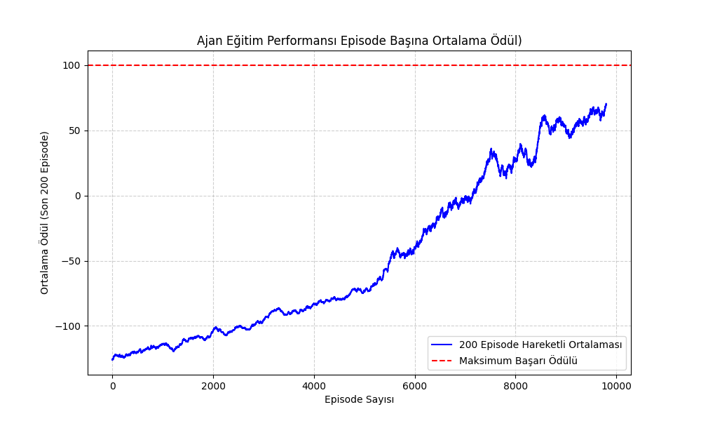

# Q-Learning ile Grid Tabanlı Boyama Optimizasyonu

Bu proje, endüstriyel boya robotlarında görülen minimum kaynak kullanımı ve minimum zaman optimizasyonu probleminden esinlenerek oluşturulmuş bir pekiştirmeli öğrenme simülasyonudur.

Amaç, **5×5** bir grid üzerinde sınırlı boya stoğuyla hedef bölgeyi (3×3) en verimli şekilde boyayabilen bir ajan eğitmektir.

## Teknik Detaylar ve Algoritma

**1. Ortam (GridEnvironment)**

- Boyut: 5x5 grid
- Hedef Bölge: `0,0` ile `2,2` koordinatları arasında rastgele 3×3’lük bir alan
- Ajan Durumu (State):
    -   Ajan Konumu ($R,C$): Ajanın mevcut satır/sütun koordinatları
    -   Kalan Boya Miktarı ($P$): 0 ile 9 arasında 

**2. Eylem Uzayı (Actions)**

Ajanın her durumda gerçekleştirebileceği **5 farklı ayrık eylem** mevcuttur:
- Hareket: Yukarı, Aşağı, Sol, Sağ `(0-3)`
- Boyama: Bulunduğu hücreyi boyar ve boya stoğunu azaltır `(4)`

**3. Durum Uzayı (State Space)**

Ajanın karar vermesi için gerekli tüm bilgiyi içeren ve Q-Tablosunun boyutunu belirleyen yapıdır.

$$\mathbf{S} = (\text{Izgara Durumu}, \text{Ajan Konumu}, \text{Boya Stoğu}, \text{Hedef Başlangıç Konumu})$$

| Bileşen | Değer Aralığı | Boyut | Açıklama |
|---|---|---|---|
| Izgara Durumu | $2^{25}$ | 33.554.432 | 5x5 hücrenin boyalı/boyasız (1/0) durumu. |
| Ajan Konumu | $(r, c)$ | 25 | Ajanın ızgaradaki (0,0)'dan (4,4)'e kadar konumu. |
| Boya Stoğu | $[0, 9]$ | 10 | Kalan boya miktarı. |
| Hedef Başlangıç Konumu | $(r_t, c_t)$ | 9 | Boyanacak hedef bölgenin başlangıç konum sayısı. |

**4. Ödül Sistemi (Reward Function)**

Ödül sistemi, ajanı minimum atıklı hızlı boyama hedefine yönlendirmek için tasarlandı.

- Hedef bölgenin tamamen boyanması: **+100**
- Hedef bölgedeki boyanmamış bir hücresinin boyanması: **+5**
- Her adım (zaman maliyeti): **-2**
- Izgara sınırlarına çarpma: **-4**
- Hedef dışı bir hücreyi boyama (yüksek atık cezası): **-10**
- Zaten boyanmış bir hücreyi tekrar boyama: **-3**

**5. Öğrenme Algoritması ve Hiperparametreler**

Ajanın sınırlı boya stoğuyla hedef yüzeyi en verimli şekilde boyamayı öğrenmesi için **Q-Learning** algoritması kullanıldı. Q-Learning, her durum-eylem çifti için beklenen ödülü tahmin ederek ajan için en optimal politikayı bulur.

$$\mathbf{Q_{yeni}(s, a) = Q_{eski}(s, a) + \alpha [r + \gamma \max_{a'} Q(s', a') - Q_{eski}(s, a)]}$$

- Bölüm Sayısı: 50000
- Öğrenme Hızı($\alpha$): 0.1
- İskonto Faktörü ($\gamma$): 0.95

Ajanın hem keşfetme hem sömürme davranışlarını dengelemek için **epsilon-greedy** stratejisi kullanıldı. 

- Başlangıç ($\epsilon = 1.0$): Ajan çoğunlukla rastgele eylemler yaparak ortamı keşfeder ve Q-Tablosunu doldurmaya başlar.

- Eğitim İlerledikçe ($\epsilon \leftarrow \epsilon \times 0.999$): Ajan, Q-Tablosundaki değerlere dayanarak kararlar vermeye başlar, ancak hala yeni durumları keşfetmek için rastgele eylemlere yer verir. Bu aşamada ödül eğrisi hızla yükselir.  

- Alt Sınır($\epsilon_{\text{min}} = 0.01$): Ajan neredeyse tamamen sömürüye geçer. Bu, eğitim boyunca öğrendiği optimal politikayı sürekli olarak uyguladığı anlamına gelir.
 
##  Sonuçlar Ve Performans
Eğitim tamamlandıktan sonra, projenin çalıştığı dizinde aşağıdaki dosyalar oluşturulacaktır:

**1. `training_performance.png`**:  Ajanın öğrenme sürecini gösteren Episode başına ortalama ödül grafiğidir.

 

- 0–10.000 episode: Ajan eğitimin başlangıcında çok düşük bir ortalama ödüle sahiptir. Bu, ajanın başlangıçta rastgele davrandığını ve yüksek miktarda israf / yanlış hareket yaptığını gösterir.
- 10.000–20.000 episode: Ortalama ödül eğrisi en dik artışını bu aralıkta gerçekleştirir. Ödül, negatif değerlerden hızla pozitif değerlere ve maksimum başarı seviyesine doğru yükselir.
- 20.000–50.000 episode: Yaklaşık 25.000 episode civarında, ortalama ödül çizgisi kırmızı kesikli çizgi ile temsil edilen Maksimum Başarı Ödülüne (100) ulaşır ve bu seviyede dalgalanmaya başlar.

Grafik, RL ajanının başarılı bir şekilde eğitildiğini ve yaklaşık 25.000 episode'da öğrenmeyi tamamlayarak görevin maksimum potansiyel performansına ulaştığını göstermektedir. Ajan, görevi başarılı bir şekilde gerçekleştirmeyi öğrenmiştir.

**2. `test_agent.gif`**: Eğitilmiş ajanın optimal politikayı uygularken grid üzerindeki hareketini ve boyama sırasını gösteren animasyonlu GIF.
   
 
